# ☕SQL Café Sales Analysis

## 📂 Data Source
- [View dataset Cafe_sales.csv](data/Cafe_sales.csv)

## About Dataset
  
  This dataset contains around **3,530 café sales transactions** recorded in a cafe. It gives info about both customer and transaction details like time of purchase, method of payment, beverage type, and amount spent. 

## 📊Project overview
  
  A complete SQL project analyzing 3,530 café sales transactions, including customer behavior, sales patterns, and revenue insights utilizing **SQLite Studio**.
  
  This project answers key business questions such as:

- Which coffee products generate the most revenue

- What time of day customers spend the most

- Which payment methods dominate

- What days and months perform best

- How hourly, daily, and monthly trends impact sales

## 📁Data description

| Column Name | Description                                               |
|-------------|-----------------------------------------------------------|
| Hour of the day | The hour when the purchase occurred                   |
| Cash type       | Payment method used                                   |
| Price           | The amount of money spent on the purchase             |
| Coffee name     | The type of coffee or drink purchased                 |
| Time of Day     | Morning, Afternoon, Evening, etc                      |
| Weekday         | The day of the week on which the transaction occurred |
| Month name      | The month when the transaction was recorded           |
| Sorting of day or month | Weekdays and months sorting               |
| Date | Date of the transaction                                      |
| Time | Time of purchase                                             |
| Full timestamps | Date & time of purchase                           |

## 🧹 Data Cleaning Steps

*Cleaning included:*

- Fixing inconsistent text formatting

- Converting dates to YYYY-MM-DD

- Converting numeric fields

- Removing duplicates

- Creating day_name from weekday numbers

- Adding derived fields like hour and full timestamp

  **[View cleaning SQL script](Cafe_sales_data_cleaning)**

## 📈 Key Performance Indicators (KPIs)

1. Total Revenue
2. Revenue by Coffee Type
3. Revenue by Day of Week
4. Peak Sales Hour

   **[View KPIs SQLscript](Cafe_sales_KPI)**

## 📊 Data Flow Diagram

```mermaid
flowchart TD
    A[Raw Café Sales CSV] --> B[SQLiteStudio Import]
    B --> C[Data Cleaning]
    C --> D[Exploratory Queries]
    D --> E[KPIs & Insights]
    E --> F[README Documentation]
```

## 📌 Insights Summary

- Morning hours generate the highest revenue

- Latte and Cappuccino are the top‑selling beverages

- Friday is the strongest revenue day

- Card payments dominate over cash

- Revenue increases significantly during mid‑month

- Customer behavior shows consistent weekday patterns

## 🛠️ Tools Used

- SQLiteStudio for SQL queries

- GitHub for version control

- Markdown for documentation
