# ☕SQL Café Sales Analysis

## 📂 Data Source
- [View dataset Cafe_sales.csv](data/Cafe_sales.csv)

## About Dataset
  
  This dataset contains around **3,530 café sales transactions** recorded in a cafe. It gives info about both customer and transaction details like time of purchase, method of payment, beverage type, and amount spent. 


## 📊Project overview
  
  A complete SQL project analyzing 3,530 café sales transactions, including customer behavior, sales patterns, and revenue insights utilizing **SQLite Studio**.
  
  This project answers key business questions such as:

- Which coffee products generate the most revenue

- What time of day customers spend the most

- Which payment methods dominate

- What days and months perform best

- How hourly, daily, and monthly trends impact sales


## 📁Data description

| Column Name | Description                                               |
|-------------|-----------------------------------------------------------|
| Hour of the day | The hour when the purchase occurred                   |
| Cash type       | Payment method used                                   |
| Price           | The amount of money spent on the purchase             |
| Coffee name     | The type of coffee or drink purchased                 |
| Time of Day     | Morning, Afternoon, Evening, etc                      |
| Weekday         | The day of the week on which the transaction occurred |
| Month name      | The month when the transaction was recorded           |
| Sorting of day or month | Weekdays and months sorting               |
| Date | Date of the transaction                                      |
| Time | Time of purchase                                             |
| Full timestamps | Date & time of purchase                           |


## 🧹 Data Cleaning Steps


*Cleaning included:*

- Fixing inconsistent text formatting

- Converting dates to YYYY-MM-DD

- Converting numeric fields

- Removing duplicates

- Creating day_name from weekday numbers

- Adding derived fields like hour and full timestamp

 <details>
  <summary>Click to expand SQL code</summary>

```sql
-- Checking for NULL values
SELECT SUM(CASE WHEN hour_of_day IS NULL THEN 1 ELSE 0 END) AS null_hour_of_day,
       SUM(CASE WHEN cash_type IS NULL THEN 1 ELSE 0 END) AS null_cash_type,
       SUM(CASE WHEN price IS NULL THEN 1 ELSE 0 END) AS null_price,
       SUM(CASE WHEN coffee_name IS NULL THEN 1 ELSE 0 END) AS null_coffee_name,
       SUM(CASE WHEN time_of_day IS NULL THEN 1 ELSE 0 END) AS null_time_of_day,
       SUM(CASE WHEN weekday IS NULL THEN 1 ELSE 0 END) AS null_weekday,
       SUM(CASE WHEN month_name IS NULL THEN 1 ELSE 0 END) AS null_month_name,
       SUM(CASE WHEN weekday_sort IS NULL THEN 1 ELSE 0 END) AS null_weekday_sort,
       SUM(CASE WHEN date IS NULL THEN 1 ELSE 0 END) AS null_date,
       SUM(CASE WHEN time IS NULL THEN 1 ELSE 0 END) AS null_time
  FROM coffee_sales;

-- Remove duplicates
UPDATE coffee_sales
   SET price = CAST (price AS REAL),
       hour_of_day = CAST (hour_of_day AS INTEGER),
       weekday_sort = CAST (weekday_sort AS INTEGER),
       month_sort = CAST (month_sort AS INTEGER);

-- Checking for blank or empty strings
SELECT *
  FROM coffee_sales
 WHERE cash_type = '' OR
       coffee_name = '' OR
       weekday = '' OR
       time_of_day = '';

-- Standardize text fields: Fix casing, remove trailing spaces, unify naming
UPDATE coffee_sales
   SET coffee_name = UPPER(SUBSTR(TRIM(coffee_name), 1, 1) ) || LOWER(SUBSTR(TRIM(coffee_name), 2) ),
       cash_type = UPPER(SUBSTR(TRIM(cash_type), 1, 1) ) || LOWER(SUBSTR(TRIM(cash_type), 2) ),
       time_of_day = UPPER(SUBSTR(TRIM(time_of_day), 1, 1) ) || LOWER(SUBSTR(TRIM(time_of_day), 2) ),
       weekday = UPPER(SUBSTR(TRIM(weekday), 1, 1) ) || LOWER(SUBSTR(TRIM(weekday), 2) ),
       month_name = UPPER(SUBSTR(TRIM(month_name), 1, 1) ) || LOWER(SUBSTR(TRIM(month_name), 2) );

-- Convert date (MM/DD/YYYY → YYYY‑MM‑DD)
UPDATE coffee_sales
   SET date = SUBSTR(date, 7, 4) || '-' || 
              SUBSTR(date, 1, 2) || '-' || 
              SUBSTR(date, 4, 2) 
 WHERE LENGTH(date) = 10;

--Convert time (HH:MM:SS)
UPDATE coffee_sales
SET time = TRIM(time);

-- Convert numeric fields
UPDATE coffee_sales
   SET price = CAST (price AS REAL),
       hour_of_day = CAST (hour_of_day AS INTEGER),
       weekday_sort = CAST (weekday_sort AS INTEGER),
       month_sort = CAST (month_sort AS INTEGER);

-- Add derived field
ALTER TABLE coffee_sales ADD full_timestamp TEXT;

UPDATE coffee_sales
   SET full_timestamp = date || ' ' || time
```

</details>


## 📈 Key Performance Indicators (KPIs)

1. Total Revenue
2. Revenue by Coffee Type
3. Revenue by Day of Week
4. Peak Sales Hour

<details>
  <summary>Click to expland SQL code</summary>

```sql
-- Total transactions
SELECT SUM(price) AS total_revenue
  FROM coffee_sales;

-- Avg revenue per transactions
SELECT COUNT( * ) AS total_transactions
  FROM coffee_sales;

-- Revenue by coffee type
SELECT ROUND(AVG(price), 2) AS avg_revenue_per_sale
  FROM coffee_sales;

-- Top 5 best-selling coffee items
SELECT coffee_name,
       ROUND(SUM(price), 2) AS revenue
  FROM coffee_sales
 GROUP BY coffee_name
 ORDER BY revenue DESC;

-- Revenue by day of week
SELECT coffee_name,
       COUNT( * ) AS total_orders
  FROM coffee_sales
 GROUP BY coffee_name
 ORDER BY total_orders DESC
 LIMIT 5;

-- Revenue by hour of day
SELECT weekday,
       ROUND(SUM(price), 2) AS revenue
  FROM coffee_sales
 GROUP BY weekday
 ORDER BY revenue DESC;

-- Revenue by Payment method
SELECT hour_of_day,
       ROUND(SUM(price), 2) AS revenue
  FROM coffee_sales
 GROUP BY hour_of_day
 ORDER BY hour_of_day;

-- Revenue by Payment Method
SELECT cash_type,
       ROUND(SUM(price), 2) AS revenue
  FROM coffee_sales
 GROUP BY cash_type
 ORDER BY revenue DESC;

-- Monthly revenue
SELECT month_name,
       ROUND(SUM(price), 2) AS revenue
  FROM coffee_sales
 GROUP BY month_name
 ORDER BY revenue DESC;

-- Peak sales day (Highest revenue day)
SELECT date,
       ROUND(SUM(price), 2) AS revenue
  FROM coffee_sales
 GROUP BY date
 ORDER BY revenue DESC
 LIMIT 1;
```
</details>

## 📊 Data Flow Diagram

```mermaid
flowchart TD
    A[Raw Café Sales CSV] --> B[SQLiteStudio Import]
    B --> C[Data Cleaning]
    C --> D[Exploratory Queries]
    D --> E[KPIs & Insights]
    E --> F[README Documentation]
```





## 📌 Insights Summary

- Morning hours generate the highest revenue

- Latte and Cappuccino are the top‑selling beverages

- Friday is the strongest revenue day

- Card payments dominate over cash

- Revenue increases significantly during mid‑month

- Customer behavior shows consistent weekday patterns


## 🛠️ Tools Used

- SQLiteStudio for SQL queries

- GitHub for version control

- Markdown for documentation
